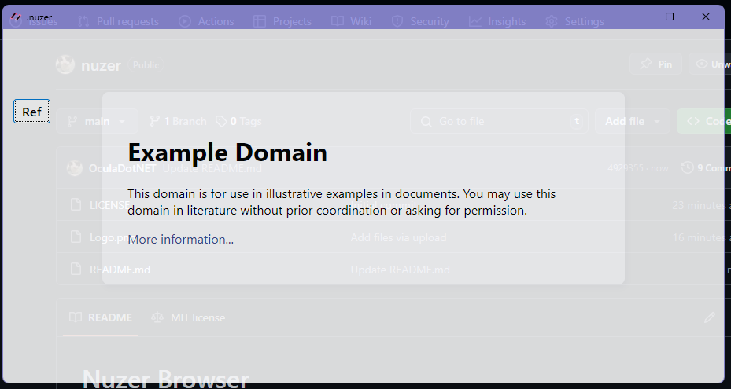
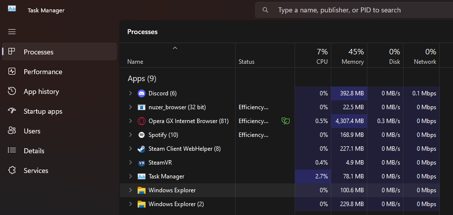

# Nuzer Browser

A simple and barebones browser made with CefSharp. This project is designed for server use!

## Table of Contents
- [Installation](#installation)
- [Features](#features)
- [Screenshots](#screenshots)

## Installation

1. Install .NET Framework From Microsofts Website:
         https://dotnet.microsoft.com/en-us/download/dotnet-framework/net472

2. Install newest release.

3. Extract .zip File.

4. Put Your Website in "putwebsiteinhere.txt"

5. Run nuzer.exe!

## Features

‣‣ Low Hardware Usage!
         Around 15MB RAM
         5% CPU

‣‣ Transparent Window!

‣‣ Refresh Button!

‣‣ No Other UI! Entirely Browser.

## Screenshots

